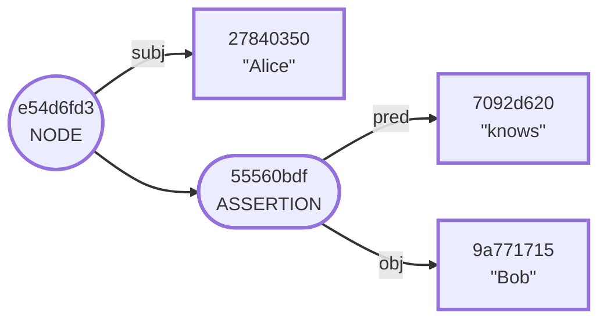

# Preparing Mermaid Images for Inclusion in IETF Internet Drafts

1. Export the Mermaid diagram to a file. Use no styles that represent colors or fills.

`node_case.mermaid:`



2. Use the [mermaid command line tool](https://github.com/mermaid-js/mermaid-cli) to convert the mermaid file to PDF using the configuration file below.

```zsh!
mmdc --input images/mermaid/node_case.mermaid \
    --output images/pdf/node_case.pdf \
    --outputFormat pdf \
    --configFile mermaid_config.json
```

`mermaid_config.json:`

```json
{
    "theme": "default",
    "themeVariables": {
        "fontFamily": "sans-serif",
        "fontSize": "16px",

        "background": "transparent",
        "primaryTextColor" : "black",
        "primaryBorderColor" : "black",
        "primaryColor" : "transparent",
        "secondaryColor" : "transparent",
        "lineColor" : "black",

        "nodeBorder" : "black",
        "clusterBkg" : "transparent",
        "clusterBorder" : "black",
        "defaultLinkColor" : "black",
        "titleColor" : "black",
        "edgeLabelBackground" : "transparent",
        "mainBkg" : "transparent",
        "nodeTextColor" : "black"
    }
}
```

`node_case.pdf:`


3. In Illustrator, flatten the image:

* Remove all clip groups.
* Ungroup all groups.
* Outline all text.
* Remove the invisible border around the entire page.
* Remove the smaller invisible border around the artwork.


4. Use the artboard tools to fit the artboard to the artwork, then expand the artboard to expand the artboard by 50 pixels on both axes.


5. "Save As..." the file as SVG 1.2 Tiny:


6. Use the [svgcheck tool](https://github.com/ietf-tools/svgcheck) to repair nonconforming aspects of the file.

```
svgcheck -r \
    images/svg/node_case.svg \
    --out images/svg-validated/node_case.svg
```

7. Remove ` x="0px" y="0px"` from the `svg` element:

```
sed -e "s/ x=\"0px\" y=\"0px\"//g" -i .backup images/svg-validated/node_case.svg
sed -e "s/ id=\"Layer_1\"//g" -i .backup images/svg-validated/node_case.svg
rm images/svg-validated/node_case.svg.backup
```

8. Include the SVG in the markdown file:

```
<artwork type="svg" src="images/svg-validated/node_case.svg"/>
```


